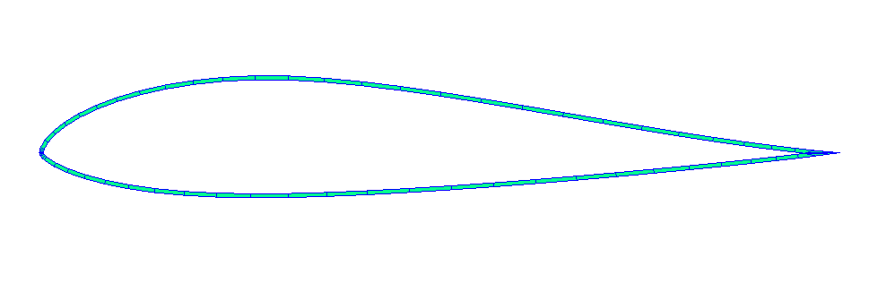

# Batch Cross-sectional Analyses

## Overview

This example demonstrates how to drive PreVABS and VABS in batch mode to compute Timoshenko beam properties for many airfoil cross-sections.
Each case generates an airfoil cross-section from a Selig-format coordinate file, applies a chosen material and layup, and runs PreVABS/VABS to produce sectional stiffness and inertia properties.

**Highlights**

- Run cross-sectional analyses on 1600+ airfoils
- Start from standard Selig-format airfoil coordinate files
- Reuse one PreVABS template across different materials and layup angles
- Extract sectional properties from VABS output using APIs of sgio


## Problem Setup

### Cross-Section and Layup

Airfoil data are downloaded from [UIUC airfoil coordinates database](https://m-selig.ae.illinois.edu/ads/coord_database.html).

Each cross-section is an airfoil contour with a single skin layup of fixed thickness wrapped around the entire surface.
The fiber angle of the skin lamina is set per configuration.
The leading- and trailing-edge points used by PreVABS are derived from the camber line of the input coordinates.



### Material Properties

All materials are defined in [`materials.xml`](data/materials.xml).

```{list-table} Materials
:header-rows: 2
:label: materials

* - Material
  - $\rho$
  - $E$, $E_1$
  - $E_2$
  - $\nu$, $\nu_{12}$
  - $G_{12}$
* -
  - $\mathrm{kg/m^3}$
  - $\mathrm{GPa}$
  - $\mathrm{GPa}$
  - 
  - $\mathrm{GPa}$
* - Aluminum alloy
  - 2780
  - 71.0
  - 
  - 0.33
  -
* - Carbon/epoxy UD lamina
  - 1578
  - 140.0
  - 10.0
  - 0.27
  - 4.137
```

---

## Run This Example

### Prerequisites

#### Standalone executables

- [VABS](https://analyswift.com/products/vabs-cross-sectional-analysis-tool/)
- [PreVABS](https://wenbinyugroup.github.io/prevabs/)
  - [Download](https://github.com/wenbinyugroup/prevabs/releases/)

#### Python dependencies

- [airfoils](https://github.com/airinnova/airfoils)
- [sgio](https://wenbinyugroup.github.io/sgio/)

Install dependencies:

```bash
# Install only this example's dependencies
cd examples/airfoil_cross_sections
uv sync
```

If you want the notebook visualization dependencies as well:

```bash
uv sync --extra notebook --extra plotting
```

### Run configurations

```bash
cd examples/airfoil_cross_sections

# Run one batch configuration
uv run python run.py config_skin_al_0001.json

# Results are written to results_skin_al_001.csv
# Per-case files are written under evals_skin_al_001/
```

Run all three configurations sequentially:

```bash
uv run python run.py config_skin_al_0001.json
uv run python run.py config_skin_cfrp_0001.json
uv run python run.py config_skin_cfrp_0001_45.json
```


---

## Analysis Workflow Scripting

The scripting is organized around two practical tasks:

1. Pre-processing: convert a standard airfoil coordinate file plus a shared PreVABS template into the VABS input files for one case.
2. Post-processing: read the generated VABS output and extract a small set of beam properties into a flat table.

The batch driver in [`run.py`](run.py) mainly orchestrates these two steps repeatedly across many airfoils.

### 1. Pre-Processing: Airfoil Coordinates -> VABS Input

The per-case workflow in [`main.py`](main.py) starts from a standard Selig-format airfoil file and a reusable PreVABS XML template, [`airfoil_skin_only.template.xml`](data/airfoil_skin_only.template.xml).

For each case, the script:

1. Reads the airfoil coordinates.
2. Infers the original decimal precision and reconstructs a clean Selig-format copy for the case directory.
3. Computes the leading- and trailing-edge reference points from the camber line at normalized chord locations `x=0` and `x=1`.
4. Fills those values, together with mesh/material/layup parameters, into the PreVABS template.
5. Runs `prevabs` to generate the structure-genome file (`.sg`), then runs `vabs` on that `.sg` file.

A simplified version of the geometry preparation step is:

```python
def process_airfoil_data(airfoil_file):
    x_precision, y_precision = infer_coordinate_precision(airfoil_file)
    upper_raw, lower_raw = fileio.import_airfoil_data(str(airfoil_file))
    airfoil = airfoils.Airfoil(upper_raw, lower_raw)

    le_point = (0.0, round_with_precision(float(airfoil.camber_line(0.0)), y_precision))
    te_point = (1.0, round_with_precision(float(airfoil.camber_line(1.0)), y_precision))

    return ProcessedAirfoilData(
        title=...,
        upper=...,
        lower=...,
        x_precision=x_precision,
        y_precision=y_precision,
        le_point=le_point,
        te_point=te_point,
    )
```

Those processed coordinates are then written back out in Selig format and injected into the XML template:

```python
processed_airfoil = process_airfoil_data(airfoil_path)
copied_airfoil = working_path / airfoil_path.name
export_selig_airfoil_file(copied_airfoil, processed_airfoil)

template_context = build_template_context(
    airfoil_filename=copied_airfoil.name,
    processed_airfoil=processed_airfoil,
    material_filename="materials.xml",
    template_params=template_params,
)
prevabs_input_text = render_prevabs_input(template_text, template_context)
(working_path / "airfoil_cs.xml").write_text(prevabs_input_text, encoding="utf-8")

await run_solver_command(["prevabs", "-i", "airfoil_cs.xml", "--hm"], ...)
await run_solver_command(["vabs", "airfoil_cs.sg"], ...)
```

The shared PreVABS template is intentionally generic. The airfoil-specific data enter through only a few placeholders:

```xml
<line name="ln_af" type="airfoil">
  <points data="file" format="1" header="1">{airfoil_file}</points>
  <leading_edge>{le_x} {le_y}</leading_edge>
  <trailing_edge>{te_x} {te_y}</trailing_edge>
</line>

<lamina name="ply">
  <material>{material_name}</material>
  <thickness>{lamina_thickness}</thickness>
</lamina>

<layer lamina="ply">{fiber_angle}</layer>
```

In other words, the front end of the workflow is mostly template binding: a standard airfoil file provides the boundary coordinates, the script derives the LE/TE reference points required by PreVABS, and the template contributes the fixed modeling choices.

### 2. Post-Processing: VABS Output -> Section Properties

Once `vabs` finishes, each case has an output file such as `airfoil_cs.sg.k`. The post-processing step in [`post_process.py`](post_process.py) is deliberately small: it parses that file with [`sgio`](https://github.com/wenbinyugroup/sgio) and asks for a predefined list of property names such as `mu`, `ea`, `gj`, `ei22`, and `ei33`.

The core read step is:

```python
def read_vabs_output(vabs_output_path):
    model = sgio.read_output_model(
        str(vabs_output_path),
        file_format="vabs",
        model_type="BM2",
    )
    if model is None:
        raise RuntimeError(f"Failed to read VABS output: {vabs_output_path}")
    return model
```

Property extraction is then just a thin wrapper around `model.get(...)`:

```python
def extract_properties(model, property_names):
    available_names = {name.lower() for name in model.getAll().keys()}
    extracted = {}

    for property_name in property_names:
        value = model.get(property_name)
        if value is None and property_name.lower() not in available_names:
            raise KeyError(f"Property '{property_name}' not found")
        extracted[property_name] = value

    return extracted
```

This separation is useful in practice: once the expensive solver run has completed, you can re-extract a different set of section properties from the same `.sg.k` file without regenerating the mesh or rerunning PreVABS/VABS.

The batch script [`run.py`](run.py) simply calls this post-processing function after each successful case and appends the resulting dictionary as one row in the output CSV.

---

## Results

Each batch run produces a CSV (e.g. `results_skin_al_0001.csv`) with one row per airfoil. The notebook [`plot.ipynb`](plot.ipynb) loads all result CSVs, filters out failed cases, and renders an interactive scatter plot. Dropdown menus select which beam property is shown on the x and y axes, and legend entries toggle individual datasets on or off.

```{iframe} localhost:3100/plot.interactive.html
```

[Open plot in a new tab](./plot.interactive.html)

Beam properties for different airfoils and materials. The user can select which properties to plot on the x and y axes using the dropdown menus, choose an airfoil name to highlight across datasets, and toggle datasets on or off by clicking legend entries.

Beam model refs:

- https://wenbinyugroup.github.io/sgio/guide/model/bm_timoshenko.html

---

## Reference

### Configuration

`run.py` supports loading a JSON config file such as `config_skin_al_0001.json`.
Relative paths inside the config file are resolved relative to the config file location.

```json
{
  // Directory containing candidate airfoil coordinate files.
  "airfoil_dir": "coord_seligFmt",

  // Root output directory for per-airfoil case folders and logs.
  "working_dir": "evals_skin_al_0001",

  // Optional explicit subset of airfoil files to run.
  // Use null to run all files under airfoil_dir.
  "airfoil_files": null,

  // Optional random sample size from the selected airfoils.
  "sample_size": null,

  // Random seed used when sample_size is not null.
  "seed": 0,

  // Number of airfoil cases to run concurrently.
  "jobs": 10,

  // Optional timeout in seconds for each prevabs/vabs command.
  "solver_timeout": 10,

  // Failure policy: "continue" records a failed case and moves on;
  // "stop" aborts the whole batch on the first failure.
  "failed_case": "continue",

  // Section properties to extract from the VABS output.
  "properties": [
    "mu",
    "ea", "gj", "ga22", "ga33", "ei22", "ei33",
    "cmp12r", "cmp13r", "cmp14r", "cmp15r", "cmp16r",
    "cmp23r", "cmp24r", "cmp25r", "cmp26r",
    "cmp34r", "cmp35r", "cmp36r",
    "cmp45r", "cmp46r",
    "cmp56r",
    "tc2", "tc3", "sc2", "sc3"
  ],

  // Output CSV path. When running from a config file, a relative path is
  // resolved next to the config file rather than under working_dir.
  "output_csv": "results_skin_al_0001.csv",

  // Optional material database copied into each case directory.
  "material_file": "data/materials.xml",

  // PreVABS XML template used for each case.
  "template_file": "data/airfoil_skin_only.template.xml",

  // Extra template placeholders. These override main.py defaults.
  "template_params": {
    "mesh_size": 0.0025,
    "element_shape": "tri",
    "element_type": "linear",
    "translate_x": -0.25,
    "translate_y": 0.0,
    "scale": 1.0,
    "material_name": "al_alloy",
    "lamina_thickness": 0.001,
    "fiber_angle": 0.0
  }
}
```


### Files

#### Scripts

- [`run.py`](run.py): Batch driver (CLI + JSON config)
- [`main.py`](main.py): Single-case workflow
- [`post_process.py`](post_process.py): VABS output parsing
- [`helpers.py`](helpers.py): Path, logging, and solver utilities
- [`plot.ipynb`](plot.ipynb): Result visualization

#### Data

- [`materials.xml`](materials.xml): Material database
- [`airfoil_skin_only.template.xml`](airfoil_skin_only.template.xml): PreVABS XML template
- [`config_skin_al_0001.json`](config_skin_al_0001.json): Aluminum case
- [`config_skin_cfrp_0001.json`](config_skin_cfrp_0001.json): CFRP 0 deg case
- [`config_skin_cfrp_0001_45.json`](config_skin_cfrp_0001_45.json): CFRP 45 deg case
